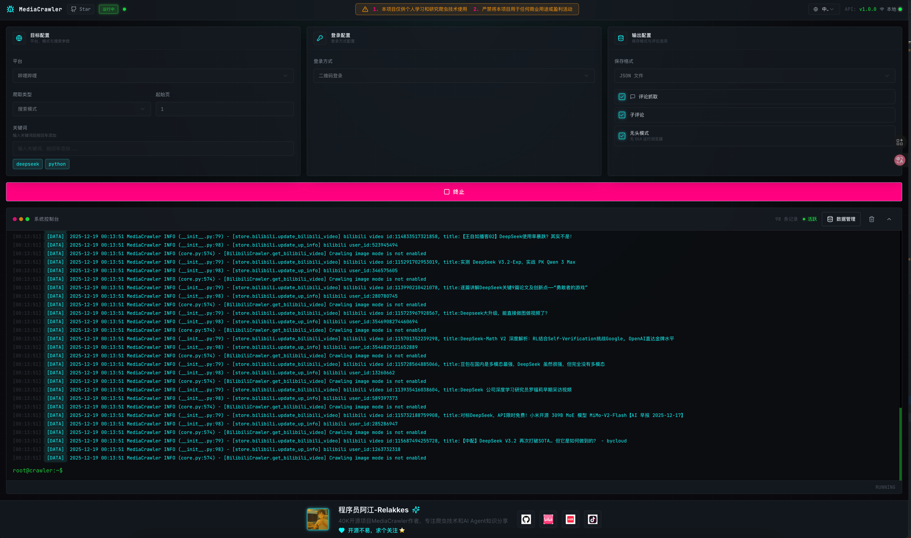

<div align="center" markdown="1">
   <sup>Special thanks to:</sup>
   <br>
   <br>
   <a href="https://go.warp.dev/MediaCrawler">
      
   </a>

### [Warp is built for coding with multiple AI agents](https://go.warp.dev/MediaCrawler)


</div>
<hr>

# 🔥 MediaCrawler - Rastreador de Plataformas de Redes Sociales 🕷️

<div align="center">

<a href="https://trendshift.io/repositories/8291" target="_blank">
  
</a>

[](https://github.com/NanmiCoder/MediaCrawler/stargazers)
[](https://github.com/NanmiCoder/MediaCrawler/network/members)
[](https://github.com/NanmiCoder/MediaCrawler/issues)
[](https://github.com/NanmiCoder/MediaCrawler/pulls)
[](https://github.com/NanmiCoder/MediaCrawler/blob/main/LICENSE)
[](README.md)
[](README_en.md)
[](README_es.md)

</div>

> **Descargo de responsabilidad:**
> 
> Por favor, utilice este repositorio únicamente con fines de aprendizaje ⚠️⚠️⚠️⚠️, [Casos ilegales de web scraping](https://github.com/HiddenStrawberry/Crawler_Illegal_Cases_In_China)  <br>
>
>Todo el contenido de este repositorio es únicamente para fines de aprendizaje y referencia, y está prohibido el uso comercial. Ninguna persona u organización puede usar el contenido de este repositorio para propósitos ilegales o infringir los derechos e intereses legítimos de otros. La tecnología de web scraping involucrada en este repositorio es solo para aprendizaje e investigación, y no puede ser utilizada para rastreo a gran escala de otras plataformas u otras actividades ilegales. Este repositorio no asume ninguna responsabilidad legal por cualquier responsabilidad legal que surja del uso del contenido de este repositorio. Al usar el contenido de este repositorio, usted acepta todos los términos y condiciones de este descargo de responsabilidad.
>
> Haga clic para ver un descargo de responsabilidad más detallado. [Haga clic para saltar](#disclaimer)

## 📖 Introducción del Proyecto

Una poderosa **herramienta de recolección de datos de redes sociales multiplataforma** que soporta el rastreo de información pública de plataformas principales incluyendo Xiaohongshu, Douyin, Kuaishou, Bilibili, Weibo, Tieba, Zhihu, y más.

### 🔧 Principios Técnicos

- **Tecnología Central**: Basado en el framework de automatización de navegador [Playwright](https://playwright.dev/) para login y mantenimiento del estado de login
- **No Requiere Ingeniería Inversa de JS**: Utiliza el entorno de contexto del navegador con estado de login preservado para obtener parámetros de firma a través de expresiones JS
- **Ventajas**: No necesita hacer ingeniería inversa de algoritmos de encriptación complejos, reduciendo significativamente la barrera técnica

## ✨ Características
| Plataforma | Búsqueda por Palabras Clave | Rastreo de ID de Publicación Específica | Comentarios Secundarios | Página de Inicio de Creador Específico | Caché de Estado de Login | Pool de Proxy IP | Generar Nube de Palabras de Comentarios |
| ------ | ---------- | -------------- | -------- | -------------- | ---------- | -------- | -------------- |
| Xiaohongshu | ✅          | ✅              | ✅        | ✅              | ✅          | ✅        | ✅              |
| Douyin   | ✅          | ✅              | ✅        | ✅              | ✅          | ✅        | ✅              |
| Kuaishou   | ✅          | ✅              | ✅        | ✅              | ✅          | ✅        | ✅              |
| Bilibili   | ✅          | ✅              | ✅        | ✅              | ✅          | ✅        | ✅              |
| Weibo   | ✅          | ✅              | ✅        | ✅              | ✅          | ✅        | ✅              |
| Tieba   | ✅          | ✅              | ✅        | ✅              | ✅          | ✅        | ✅              |
| Zhihu   | ✅          | ✅              | ✅        | ✅              | ✅          | ✅        | ✅              |


<strong>¡Lanzamiento Mayor de MediaCrawlerPro! ¡El código abierto no es fácil, bienvenido a suscribirse y apoyar!</strong>

> Enfócate en aprender el diseño arquitectónico de proyectos maduros, no solo tecnología de rastreo. ¡La filosofía de diseño de código de la versión Pro también vale la pena estudiar en profundidad!

[MediaCrawlerPro](https://github.com/MediaCrawlerPro) ventajas principales sobre la versión de código abierto:

#### 🎯 Actualizaciones de Características Principales
- ✅ **Agente de Deconstrucción de Contenido** (Nueva función)
- ✅ **Funcionalidad de reanudación de rastreo** (Característica clave)
- ✅ **Soporte de múltiples cuentas + pool de proxy IP** (Característica clave)
- ✅ **Eliminar dependencia de Playwright**, más fácil de usar
- ✅ **Soporte completo de entorno Linux**

#### 🏗️ Optimización de Diseño Arquitectónico
- ✅ **Optimización de refactorización de código**, más legible y mantenible (lógica de firma JS desacoplada)
- ✅ **Calidad de código de nivel empresarial**, adecuado para construir proyectos de rastreo a gran escala
- ✅ **Diseño arquitectónico perfecto**, alta escalabilidad, mayor valor de aprendizaje del código fuente

#### 🎁 Características Adicionales
- ✅ **Aplicación de escritorio descargadora de videos de redes sociales** (adecuada para aprender desarrollo full-stack)
- ✅ **Recomendaciones de feed de página de inicio multiplataforma** (HomeFeed)
- [ ] **Agente AI basado en análisis de comentarios está en desarrollo 🚀🚀**

Haga clic para ver: [Página de Inicio del Proyecto MediaCrawlerPro](https://github.com/MediaCrawlerPro) para más información

## 🚀 Inicio Rápido

> 💡 **¡El código abierto no es fácil, si este proyecto te ayuda, por favor da una ⭐ Estrella para apoyar!**

## 📋 Prerrequisitos

### 🚀 Instalación de uv (Recomendado)

Antes de proceder con los siguientes pasos, por favor asegúrese de que uv esté instalado en su computadora:

- **Guía de Instalación**: [Guía Oficial de Instalación de uv](https://docs.astral.sh/uv/getting-started/installation)
- **Verificar Instalación**: Ingrese el comando `uv --version` en la terminal. Si el número de versión se muestra normalmente, la instalación fue exitosa
- **Razón de Recomendación**: uv es actualmente la herramienta de gestión de paquetes Python más poderosa, con velocidad rápida y resolución de dependencias precisa

### 🟢 Instalación de Node.js

El proyecto depende de Node.js, por favor descargue e instale desde el sitio web oficial:

- **Enlace de Descarga**: https://nodejs.org/en/download/
- **Requisito de Versión**: >= 16.0.0

### 📦 Instalación de Paquetes Python

```shell
# Entrar al directorio del proyecto
cd MediaCrawler

# Usar el comando uv sync para asegurar la consistencia de la versión de python y paquetes de dependencias relacionados
uv sync
```

### 🌐 Instalación de Controlador de Navegador

```shell
# Instalar controlador de navegador
uv run playwright install
```

> **💡 Consejo**: MediaCrawler ahora soporta usar playwright para conectarse a su navegador Chrome local, resolviendo algunos problemas causados por Webdriver.
>
> Actualmente, `xhs` y `dy` están disponibles usando el modo CDP para conectarse a navegadores locales. Si es necesario, verifique los elementos de configuración en `config/base_config.py`.

## 🚀 Ejecutar Programa Rastreador

```shell
# El proyecto no habilita el modo de rastreo de comentarios por defecto. Si necesita comentarios, por favor modifique la variable ENABLE_GET_COMMENTS en config/base_config.py
# Otras opciones soportadas también pueden verse en config/base_config.py con comentarios en chino

# Leer palabras clave del archivo de configuración para buscar publicaciones relacionadas y rastrear información de publicaciones y comentarios
uv run main.py --platform xhs --lt qrcode --type search

# Leer lista de ID de publicaciones específicas del archivo de configuración para obtener información e información de comentarios de publicaciones específicas
uv run main.py --platform xhs --lt qrcode --type detail

# Abrir la APP correspondiente para escanear código QR para login

# Para ejemplos de uso de rastreador de otras plataformas, ejecute el siguiente comando para ver
uv run main.py --help
```

## Soporte WebUI

<details>
<summary>🖥️ <strong>Interfaz de Operación Visual WebUI</strong></summary>

MediaCrawler proporciona una interfaz de operación visual basada en web, permitiéndole usar fácilmente las funciones del rastreador sin línea de comandos.

#### Iniciar Servicio WebUI

```shell
# Iniciar servidor API (puerto predeterminado 8080)
uv run uvicorn api.main:app --port 8080 --reload

# O iniciar usando método de módulo
uv run python -m api.main
```

Después de iniciar exitosamente, visite `http://localhost:8080` para abrir la interfaz WebUI.

#### Características de WebUI

- Configuración visual de parámetros del rastreador (plataforma, método de login, tipo de rastreo, etc.)
- Vista en tiempo real del estado de ejecución del rastreador y logs
- Vista previa y exportación de datos

#### Vista Previa de la Interfaz



</details>

<details>
<summary>🔗 <strong>Usando gestión de entorno venv nativo de Python (No recomendado)</strong></summary>

#### Crear y activar entorno virtual de Python

> Si rastrea Douyin y Zhihu, necesita instalar el entorno nodejs con anticipación, versión mayor o igual a: `16`

```shell
# Entrar al directorio raíz del proyecto
cd MediaCrawler

# Crear entorno virtual
# Mi versión de python es: 3.9.6, las librerías en requirements.txt están basadas en esta versión
# Si usa otras versiones de python, las librerías en requirements.txt pueden no ser compatibles, por favor resuelva por su cuenta
python -m venv venv

# macOS & Linux activar entorno virtual
source venv/bin/activate

# Windows activar entorno virtual
venv\Scripts\activate
```

#### Instalar librerías de dependencias

```shell
pip install -r requirements.txt
```

#### Instalar controlador de navegador playwright

```shell
playwright install
```

#### Ejecutar programa rastreador (entorno nativo)

```shell
# El proyecto no habilita el modo de rastreo de comentarios por defecto. Si necesita comentarios, por favor modifique la variable ENABLE_GET_COMMENTS en config/base_config.py
# Otras opciones soportadas también pueden verse en config/base_config.py con comentarios en chino

# Leer palabras clave del archivo de configuración para buscar publicaciones relacionadas y rastrear información de publicaciones y comentarios
python main.py --platform xhs --lt qrcode --type search

# Leer lista de ID de publicaciones específicas del archivo de configuración para obtener información e información de comentarios de publicaciones específicas
python main.py --platform xhs --lt qrcode --type detail

# Abrir la APP correspondiente para escanear código QR para login

# Para ejemplos de uso de rastreador de otras plataformas, ejecute el siguiente comando para ver
python main.py --help
```

</details>


## 💾 Almacenamiento de Datos

MediaCrawler soporta múltiples métodos de almacenamiento de datos, incluyendo CSV, JSON, Excel, SQLite y bases de datos MySQL.

📖 **Para instrucciones de uso detalladas, por favor vea: [Guía de Almacenamiento de Datos](docs/data_storage_guide.md)**


[🚀 ¡Lanzamiento Mayor de MediaCrawlerPro 🚀! ¡Más características, mejor diseño arquitectónico!](https://github.com/MediaCrawlerPro)


### 💬 Grupos de Discusión
- **Grupo de Discusión WeChat**: [Haga clic para unirse](https://nanmicoder.github.io/MediaCrawler/%E5%BE%AE%E4%BF%A1%E4%BA%A4%E6%B5%81%E7%BE%A4.html)
- **Cuenta de Bilibili**: [Sígueme](https://space.bilibili.com/434377496), compartiendo conocimientos de tecnología de IA y rastreo


### 💰 Exhibición de Patrocinadores

<a href="https://tikhub.io/?utm_source=github.com/NanmiCoder/MediaCrawler&utm_medium=marketing_social&utm_campaign=retargeting&utm_content=carousel_ad">

<br>
TikHub.io proporciona 900+ interfaces de datos altamente estables, cubriendo 14+ plataformas principales nacionales e internacionales incluyendo TK, DY, XHS, Y2B, Ins, X, etc. Soporta APIs de datos públicos multidimensionales para usuarios, contenido, productos, comentarios, etc., con 40M+ conjuntos de datos estructurados limpios. Use el código de invitación <code>cfzyejV9</code> para registrarse y recargar, y obtenga $2 adicionales de bonificación.
</a>

---

<a href="https://www.thordata.com/?ls=github&lk=mediacrawler">

<br>
Thordata: Proveedor de servicios de proxy confiable y rentable. Proporciona servicios de IP proxy global estables, eficientes y conformes para empresas y desarrolladores. Regístrese ahora para obtener 1GB de prueba gratuita de proxy residencial y 2000 llamadas serp-api.
</a>
<br>
<a href="https://www.thordata.com/products/residential-proxies/?ls=github&lk=mediacrawler">【Proxies Residenciales】</a> | <a href="https://www.thordata.com/products/web-scraper/?ls=github&lk=mediacrawler">【serp-api】</a>


### 🤝 Conviértase en Patrocinador

¡Conviértase en patrocinador y muestre su producto aquí, obteniendo exposición masiva diariamente!

**Información de Contacto**:
- WeChat: `relakkes`
- Email: `relakkes@gmail.com`
---

### 📚 Otros
- **Preguntas Frecuentes**: [Documentación Completa de MediaCrawler](https://nanmicoder.github.io/MediaCrawler/)
- **Tutorial de Rastreador para Principiantes**: [Tutorial Gratuito CrawlerTutorial](https://github.com/NanmiCoder/CrawlerTutorial)
- **Proyecto de Código Abierto de Rastreador de Noticias**: [NewsCrawlerCollection](https://github.com/NanmiCoder/NewsCrawlerCollection)


## ⭐ Gráfico de Tendencia de Estrellas

¡Si este proyecto te ayuda, por favor da una ⭐ Estrella para apoyar y que más personas vean MediaCrawler!

[](https://star-history.com/#NanmiCoder/MediaCrawler&Date)


## 📚 Referencias

- **Repositorio de Firma Xiaohongshu**: [Repositorio de firma xhs de Cloxl](https://github.com/Cloxl/xhshow)
- **Cliente Xiaohongshu**: [Repositorio xhs de ReaJason](https://github.com/ReaJason/xhs)
- **Reenvío de SMS**: [Repositorio de referencia SmsForwarder](https://github.com/pppscn/SmsForwarder)
- **Herramienta de Penetración de Intranet**: [Documentación oficial de ngrok](https://ngrok.com/docs/)


# Descargo de Responsabilidad
<div id="disclaimer">

## 1. Propósito y Naturaleza del Proyecto
Este proyecto (en adelante denominado "este proyecto") fue creado como una herramienta de investigación técnica y aprendizaje, con el objetivo de explorar y aprender tecnologías de recolección de datos de red. Este proyecto se enfoca en la investigación de tecnologías de rastreo de datos para plataformas de redes sociales, destinado a proporcionar a estudiantes e investigadores propósitos de intercambio técnico.

## 2. Declaración de Cumplimiento Legal
El desarrollador del proyecto (en adelante denominado "desarrollador") recuerda solemnemente a los usuarios que cumplan estrictamente con las leyes y regulaciones relevantes de la República Popular China al descargar, instalar y usar este proyecto, incluyendo pero no limitado a la "Ley de Ciberseguridad de la República Popular China", "Ley de Contraespionaje de la República Popular China" y todas las leyes y políticas nacionales aplicables. Los usuarios deberán asumir todas las responsabilidades legales que puedan surgir del uso de este proyecto.

## 3. Restricciones de Propósito de Uso
Este proyecto está estrictamente prohibido de ser utilizado para cualquier propósito ilegal o actividades comerciales que no sean de aprendizaje o investigación. Este proyecto no puede ser utilizado para ninguna forma de intrusión ilegal en sistemas informáticos de otras personas, ni puede ser utilizado para cualquier actividad que infrinja los derechos de propiedad intelectual de otros u otros derechos e intereses legítimos. Los usuarios deben asegurar que su uso de este proyecto sea puramente para aprendizaje personal e investigación técnica, y no puede ser utilizado para ninguna forma de actividades ilegales.

## 4. Descargo de Responsabilidad
El desarrollador ha hecho todos los esfuerzos para asegurar la legitimidad y seguridad de este proyecto, pero no asume responsabilidad por ninguna forma de pérdidas directas o indirectas que puedan surgir del uso de este proyecto por parte de los usuarios. Incluyendo pero no limitado a cualquier pérdida de datos, daño de equipos, litigios legales, etc. causados por el uso de este proyecto.

## 5. Declaración de Propiedad Intelectual
Los derechos de propiedad intelectual de este proyecto pertenecen al desarrollador. Este proyecto está protegido por la ley de derechos de autor y tratados internacionales de derechos de autor, así como otras leyes y tratados de propiedad intelectual. Los usuarios pueden descargar y usar este proyecto bajo la premisa de cumplir con esta declaración y las leyes y regulaciones relevantes.

## 6. Derechos de Interpretación Final
El desarrollador tiene los derechos de interpretación final con respecto a este proyecto. El desarrollador se reserva el derecho de cambiar o actualizar este descargo de responsabilidad en cualquier momento sin previo aviso.
</div>


## 🙏 Agradecimientos

### Soporte de Licencia de Código Abierto de JetBrains

¡Gracias a JetBrains por proporcionar soporte de licencia de código abierto gratuito para este proyecto!

<a href="https://www.jetbrains.com/?from=MediaCrawler">
    
</a>
