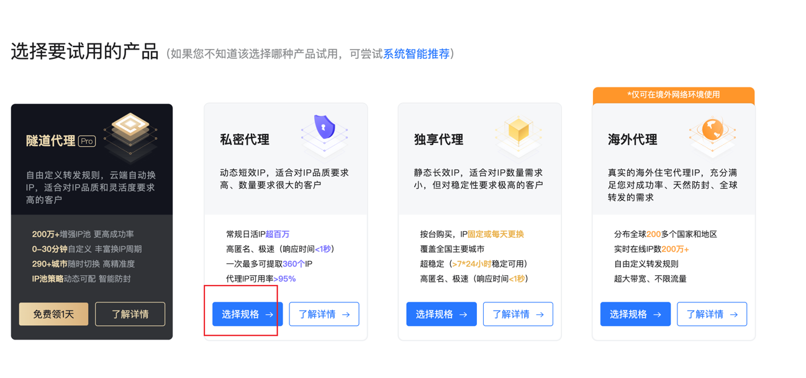
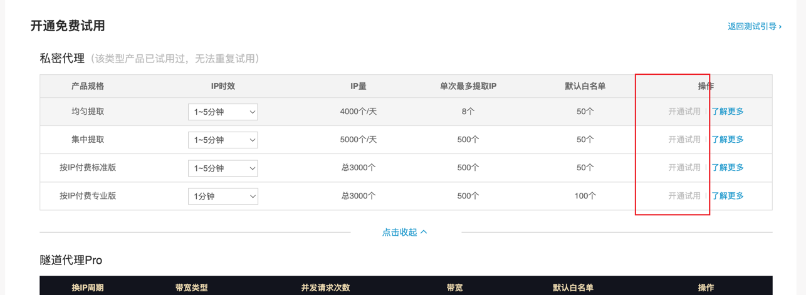
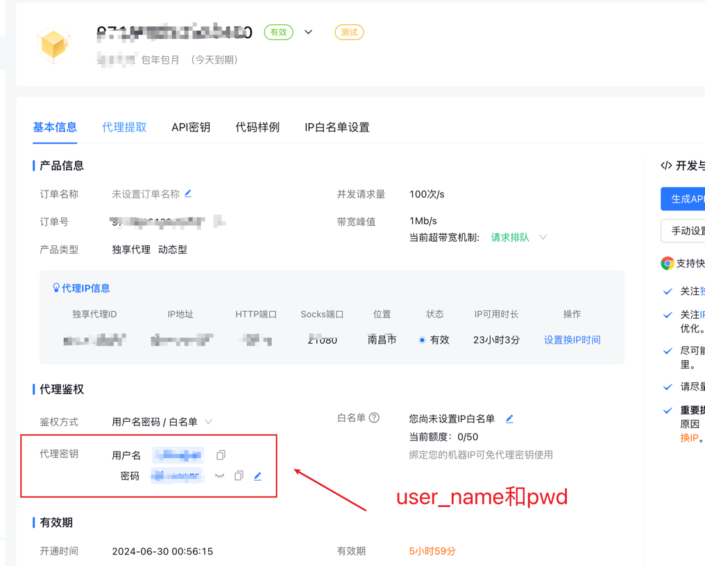
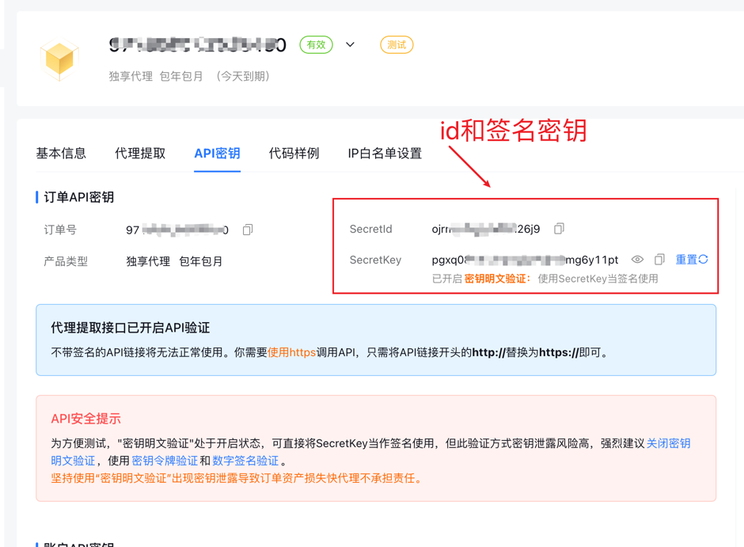

# 代理 IP 使用说明
> 还是得跟大家再次强调下，不要对一些自媒体平台进行大规模爬虫或其他非法行为，要踩缝纫机的哦🤣

## 简易的流程图


## 准备代理 IP 信息
点击 <a href="https://www.kuaidaili.com/?ref=ldwkjqipvz6c">快代理</a> 官网注册并实名认证（国内使用代理 IP 必须要实名，懂的都懂）

## 获取 IP 代理的密钥信息
从 <a href="https://www.kuaidaili.com/?ref=ldwkjqipvz6c">快代理</a> 官网获取免费试用，如下图所示


注意：选择私密代理


选择开通试用


初始化一个快代理的示例，如下代码所示，需要4个参数

```python

def new_kuai_daili_proxy() -> KuaiDaiLiProxy:
    """
    构造快代理HTTP实例
    Returns:

    """
    return KuaiDaiLiProxy(
        kdl_secret_id=os.getenv("kdl_secret_id", "你的快代理secert_id"),
        kdl_signature=os.getenv("kdl_signature", "你的快代理签名"),
        kdl_user_name=os.getenv("kdl_user_name", "你的快代理用户名"),
        kdl_user_pwd=os.getenv("kdl_user_pwd", "你的快代理密码"),
    )

```
在试用的订单中可以看到这四个参数，如下图所示

`kdl_user_name`、`kdl_user_pwd`


`kdl_secret_id`、`kdl_signature`


## 将配置文件中的`ENABLE_IP_PROXY`置为 `True`
> `IP_PROXY_POOL_COUNT` 池子中 IP 的数量

