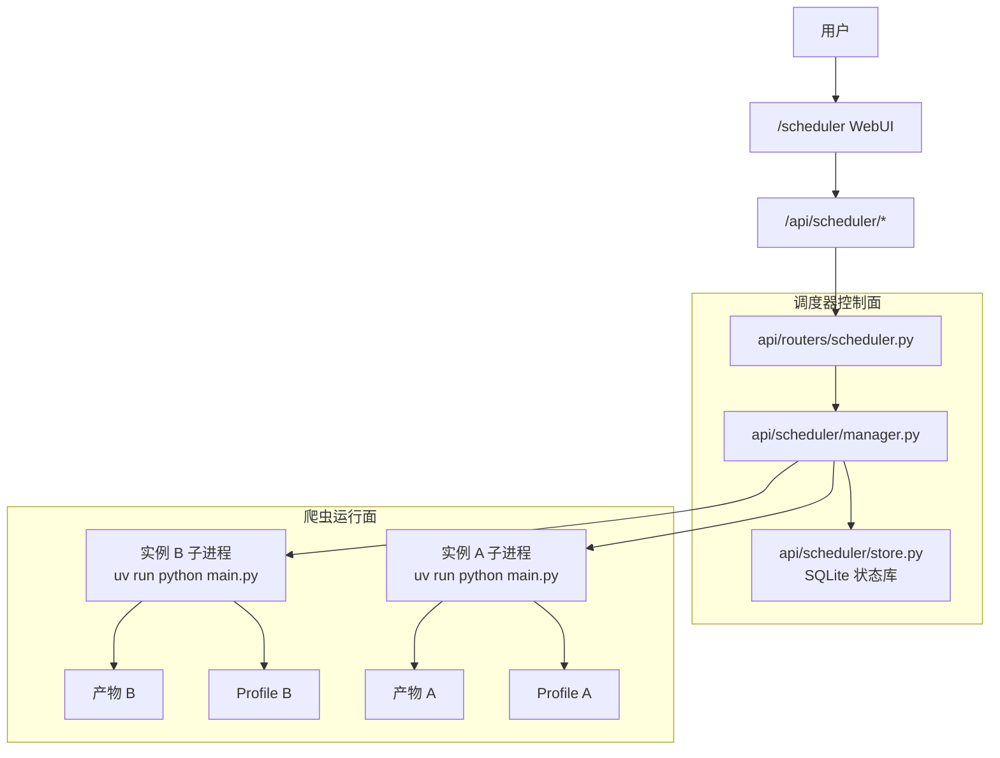

# 多实例调度器使用指南

本文档说明 MediaCrawler 多实例调度器的设计目标、运行方式、数据目录和 API。调度器用于在现有单实例爬虫基础上管理多个独立账号实例，每个实例拥有独立的登录态、浏览器 Profile、CDP 端口、默认爬取参数和任务队列。

## 1. 功能边界

多实例调度器解决以下问题：

- 多个账号实例独立保存登录凭证和浏览器上下文，避免账号状态互相污染。
- 每个实例维护自己的平台、登录方式、保存格式、CDP 端口和默认参数。
- 调度器统一创建任务、启动爬虫子进程、停止任务、收集日志、扫描产物。
- WebUI 提供实例创建、登录、任务投递、日志查看和产物查看。

调度器不改变平台爬虫的核心抓取逻辑。底层仍然通过 `main.py`、`cmd_arg/arg.py` 和各平台 `core.py` 执行搜索、详情、创作者和登录流程。

## 2. 架构图



## 3. 数据目录

调度器运行数据默认位于 `data/scheduler/`，该目录已被项目 `.gitignore` 忽略。

| 目录或文件 | 用途 |
| --- | --- |
| `data/scheduler/scheduler.db` | 实例、任务、日志和产物索引 |
| `data/scheduler/profiles/{instance_id}/` | 实例独立浏览器 Profile |
| `data/scheduler/artifacts/{instance_id}/{task_id}/` | 单个任务的抓取产物 |

如果创建实例时手动填写浏览器 Profile 目录，调度器会使用该目录；相对路径会基于项目根目录解析。

## 4. 启动方式

启动现有 FastAPI 服务：

```shell
uv run uvicorn api.main:app --port 8080 --reload
```

访问：

- 单实例 WebUI：`http://localhost:8080`
- 多实例调度器：`http://localhost:8080/scheduler`
- API 文档：`http://localhost:8080/docs`

## 5. 使用流程

1. 打开 `/scheduler`。
2. 创建实例，选择平台、登录方式、保存格式，必要时指定 CDP 端口和默认参数。
3. 点击实例行的“登录”，调度器会创建 `login` 任务，子进程只完成登录态维护，不进入抓取流程。
4. 创建搜索、详情或创作者任务，调度器会把任务加入该实例队列。
5. 查看任务状态、日志和产物列表。

实例处于 `running` 或 `stopping` 时不能修改核心配置，也不能删除实例。任务执行成功或被取消后，同实例队列中的下一个任务会自动启动；任务失败时实例进入 `error`，需要人工查看日志后再投递或启动后续任务。

## 6. 任务参数

实例的“默认参数 JSON”和任务的“任务参数 JSON”会合并，任务参数优先级更高。常用字段如下：

| 字段 | 对应 CLI 参数 | 示例 |
| --- | --- | --- |
| `enable_comments` | `--get_comment` | `true` |
| `enable_sub_comments` | `--get_sub_comment` | `false` |
| `max_notes_count` | `--crawler_max_notes_count` | `20` |
| `max_comments_count` | `--max_comments_count_singlenotes` | `10` |
| `max_concurrency_num` | `--max_concurrency_num` | `1` |
| `cookies` | `--cookies` | `"a=b; c=d"` |
| `cdp_connect_existing` | `--cdp_connect_existing` | `false` |
| `enable_ip_proxy` | `--enable_ip_proxy` | `false` |
| `ip_proxy_pool_count` | `--ip_proxy_pool_count` | `2` |
| `ip_proxy_provider_name` | `--ip_proxy_provider_name` | `"static"` |
| `static_proxy_url` | `--static_proxy_url` | `"http://host:port"` |

搜索任务的“目标”会映射为 `--keywords`，详情任务映射为 `--specified_id`，创作者任务映射为 `--creator_id`。

## 7. API 参考

### 7.1 实例 API

| 方法 | 路径 | 说明 |
| --- | --- | --- |
| `GET` | `/api/scheduler/status` | 获取调度器统计 |
| `GET` | `/api/scheduler/instances` | 获取实例列表 |
| `POST` | `/api/scheduler/instances` | 创建实例 |
| `GET` | `/api/scheduler/instances/{instance_id}` | 获取实例详情 |
| `PATCH` | `/api/scheduler/instances/{instance_id}` | 修改实例配置 |
| `DELETE` | `/api/scheduler/instances/{instance_id}` | 删除空闲实例 |
| `POST` | `/api/scheduler/instances/{instance_id}/login` | 为实例创建登录任务 |

创建实例示例：

```json
{
  "name": "小红书账号 A",
  "platform": "xhs",
  "login_type": "qrcode",
  "save_option": "jsonl",
  "headless": false,
  "default_params": {
    "enable_comments": true,
    "max_notes_count": 20
  }
}
```

### 7.2 任务 API

| 方法 | 路径 | 说明 |
| --- | --- | --- |
| `GET` | `/api/scheduler/tasks` | 获取最近任务 |
| `POST` | `/api/scheduler/tasks` | 创建任务并在实例空闲时自动启动 |
| `GET` | `/api/scheduler/tasks/{task_id}` | 获取任务详情 |
| `POST` | `/api/scheduler/tasks/{task_id}/start` | 手动启动排队任务 |
| `POST` | `/api/scheduler/tasks/{task_id}/cancel` | 取消排队任务或停止运行任务 |
| `GET` | `/api/scheduler/tasks/{task_id}/logs` | 获取任务日志 |
| `GET` | `/api/scheduler/tasks/{task_id}/artifacts` | 获取任务产物索引 |

创建任务示例：

```json
{
  "instance_id": "实例 ID",
  "crawler_type": "search",
  "target_text": "编程副业,AI 工具",
  "params": {
    "enable_comments": true,
    "max_comments_count": 10
  }
}
```

## 8. 与原单实例模式的关系

原单实例 WebUI 和 `/api/crawler/*` 接口仍然保留，适合临时手动运行一个爬虫任务。多实例调度器使用 `/api/scheduler/*`，每个任务都会启动独立子进程，并显式传入：

- `--instance_id`
- `--browser_profile_dir`
- `--cdp_debug_port`
- `--cdp_connect_existing false`
- `--save_data_path data/scheduler/artifacts/{instance_id}/{task_id}`

因此，多实例模式下账号登录态、浏览器状态和抓取产物都按实例或任务隔离。

## 9. 注意事项

- 本功能仍然应遵守项目非商业学习用途声明，不应扩大抓取规模或增加目标平台压力。
- 多实例同时运行会同时启动多个浏览器上下文，需要预留足够 CPU、内存和端口。
- 如果使用 Cookie 登录，可以把 `cookies` 放在实例默认参数中；如果使用二维码登录，建议先执行登录任务再投递抓取任务。
- 如果任务失败，优先查看任务日志和对应实例的 `last_error` 字段。
