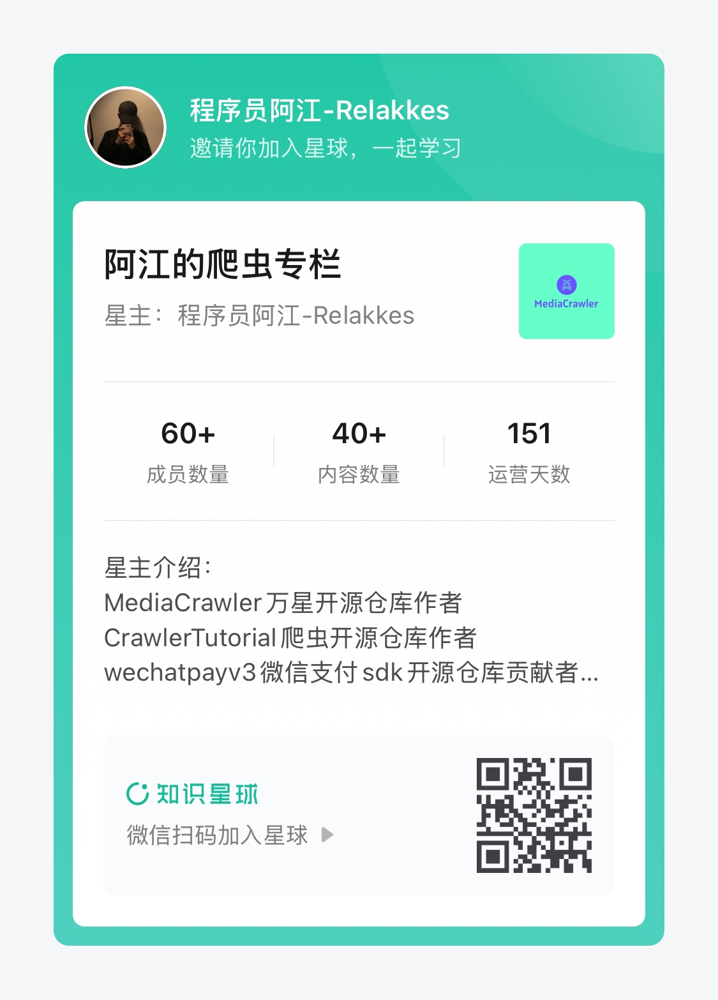

# 知识星球专栏

## 基本介绍

文章：
- 1.爬虫JS逆向案例分享
- 2.MediaCrawler技术实现分享。
- 3.沉淀python开发经验和技巧
- ......................

提问：
- 4.在星球内向我提问关于MediaCrawler、爬虫、编程任何问题

## 章节内容
  - [逆向案例 - 某16x8平台商品列表接口逆向参数分析](https://articles.zsxq.com/id_x1qmtg8pzld9.html)
  - [逆向案例 - Product Hunt月度最佳产品榜单接口加密参数分析](https://articles.zsxq.com/id_au4eich3x2sg.html)
  - [逆向案例 - 某zhi乎x-zse-96参数分析过程](https://articles.zsxq.com/id_dui2vil0ag1l.html)
  - [逆向案例 - 某x识星球X-Signature加密参数分析过程](https://articles.zsxq.com/id_pp4madwcwcg8.html)
  - [【独创】使用Playwright获取某音a_bogus参数流程（包含加密参数分析）](https://articles.zsxq.com/id_u89al50jk9x0.html)
  - [【独创】使用Playwright低成本获取某书X-s参数流程分析（当年的回忆录）](https://articles.zsxq.com/id_u4lcrvqakuc7.html)
  - [ MediaCrawler-基于抽象类设计重构项目缓存](https://articles.zsxq.com/id_4ju73oxewt9j.html)
  - [ 手把手带你撸一个自己的IP代理池](https://articles.zsxq.com/id_38fza371ladm.html) 
  - [一次Mysql数据库中混用collation排序规则带来的bug](https://articles.zsxq.com/id_pibwr1wnst2p.html)
  - [错误使用 Python 可变类型带来的隐藏 Bug](https://articles.zsxq.com/id_f7vn89l1d303.html)
  - [【MediaCrawler】微博帖子评论爬虫教程](https://articles.zsxq.com/id_vrmuhw0ovj3t.html)
  - [Python协程在并发场景下的幂等性问题](https://articles.zsxq.com/id_wocdwsfmfcmp.html)
  - ........................................

## 加入星球

