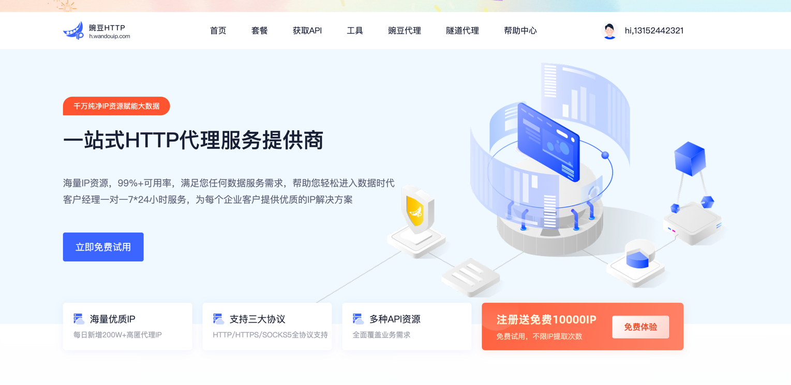
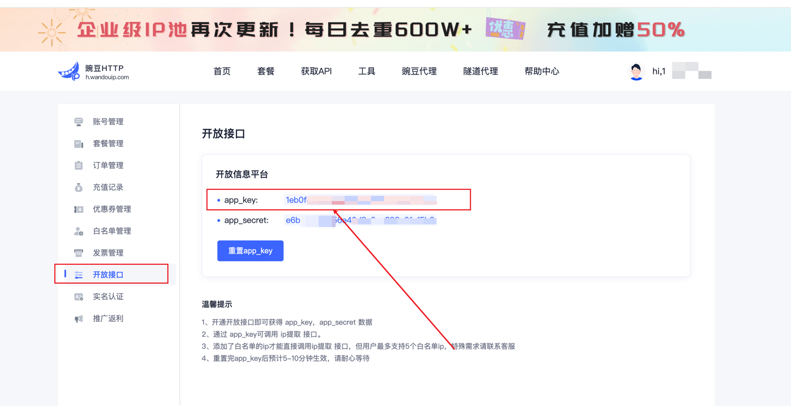

## 豌豆HTTP代理使用文档 （只支持企业用户）

## 准备代理 IP 信息
点击 <a href="https://h.wandouip.com?invite_code=rtnifi">豌豆HTTP代理</a> 官网注册并实名认证（国内使用代理 IP 必须要实名，懂的都懂）

## 获取 IP 代理的密钥信息 appkey
从 <a href="https://h.wandouip.com?invite_code=rtnifi">豌豆HTTP代理</a> 官网获取免费试用，如下图所示


选择自己需要的套餐


初始化一个豌豆HTTP代理的示例，如下代码所示，需要1个参数： app_key

```python
# 文件地址： proxy/providers/wandou_http_proxy.py
# -*- coding: utf-8 -*-

def new_wandou_http_proxy() -> WanDouHttpProxy:
    """
    构造豌豆HTTP实例
    Returns:

    """
    return WanDouHttpProxy(
        app_key=os.getenv(
            "wandou_app_key", "你的豌豆HTTP app_key"
        ),  # 通过环境变量的方式获取豌豆HTTP app_key
    )

```

在个人中心的`开放接口`找到 `app_key`，如下图所示




