# MediaCrawler 项目架构文档

## 1. 项目概述

### 1.1 项目简介

MediaCrawler 是一个多平台自媒体爬虫框架，采用 Python 异步编程实现，支持爬取主流社交媒体平台的内容、评论和创作者信息。

### 1.2 支持的平台

| 平台 | 代号 | 主要功能 |
|------|------|---------|
| 小红书 | `xhs` | 笔记搜索、详情、创作者 |
| 抖音 | `dy` | 视频搜索、详情、创作者 |
| 快手 | `ks` | 视频搜索、详情、创作者 |
| B站 | `bili` | 视频搜索、详情、UP主 |
| 微博 | `wb` | 微博搜索、详情、博主 |
| 百度贴吧 | `tieba` | 帖子搜索、详情 |
| 知乎 | `zhihu` | 问答搜索、详情、答主 |

### 1.3 核心功能特性

- **多平台支持**：统一的爬虫接口，支持 7 大主流平台
- **多种登录方式**：二维码、手机号、Cookie 三种登录方式
- **多种存储方式**：CSV、JSON、SQLite、MySQL、MongoDB、Excel
- **反爬虫对策**：CDP 模式、代理 IP 池、请求签名
- **异步高并发**：基于 asyncio 的异步架构，高效并发爬取
- **词云生成**：自动生成评论词云图

---

## 2. 系统架构总览

### 2.1 高层架构图

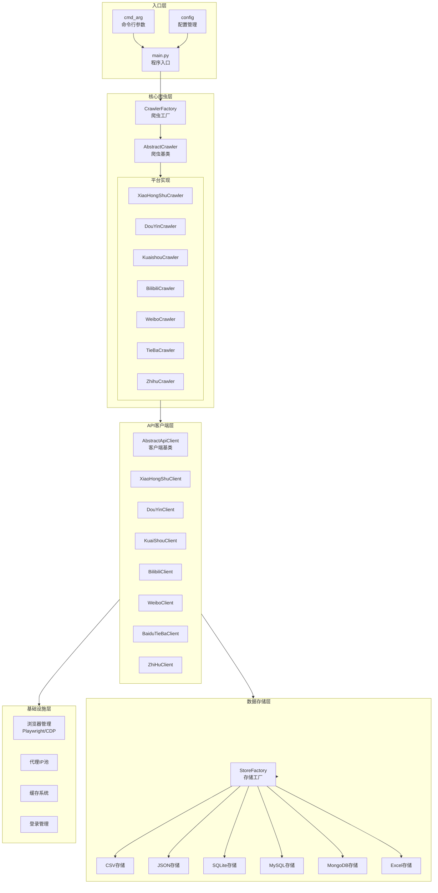

### 2.2 数据流向图

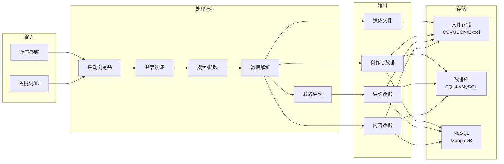

---

## 3. 目录结构

```
MediaCrawler/
├── main.py                 # 程序入口
├── var.py                  # 全局上下文变量
├── pyproject.toml          # 项目配置
│
├── base/                   # 基础抽象类
│   └── base_crawler.py     # 爬虫、登录、存储、客户端基类
│
├── config/                 # 配置管理
│   ├── base_config.py      # 核心配置
│   ├── db_config.py        # 数据库配置
│   └── {platform}_config.py # 平台特定配置
│
├── media_platform/         # 平台爬虫实现
│   ├── xhs/                # 小红书
│   ├── douyin/             # 抖音
│   ├── kuaishou/           # 快手
│   ├── bilibili/           # B站
│   ├── weibo/              # 微博
│   ├── tieba/              # 百度贴吧
│   └── zhihu/              # 知乎
│
├── store/                  # 数据存储
│   ├── excel_store_base.py # Excel存储基类
│   └── {platform}/         # 各平台存储实现
│
├── database/               # 数据库层
│   ├── models.py           # ORM模型定义
│   ├── db_session.py       # 数据库会话管理
│   └── mongodb_store_base.py # MongoDB基类
│
├── proxy/                  # 代理管理
│   ├── proxy_ip_pool.py    # IP池管理
│   ├── proxy_mixin.py      # 代理刷新混入
│   └── providers/          # 代理提供商
│
├── cache/                  # 缓存系统
│   ├── abs_cache.py        # 缓存抽象类
│   ├── local_cache.py      # 本地缓存
│   └── redis_cache.py      # Redis缓存
│
├── tools/                  # 工具模块
│   ├── app_runner.py       # 应用运行管理
│   ├── browser_launcher.py # 浏览器启动
│   ├── cdp_browser.py      # CDP浏览器管理
│   ├── crawler_util.py     # 爬虫工具
│   └── async_file_writer.py # 异步文件写入
│
├── model/                  # 数据模型
│   └── m_{platform}.py     # Pydantic模型
│
├── libs/                   # JS脚本库
│   └── stealth.min.js      # 反检测脚本
│
└── cmd_arg/                # 命令行参数
    └── arg.py              # 参数定义
```

---

## 4. 核心模块详解

### 4.1 爬虫基类体系

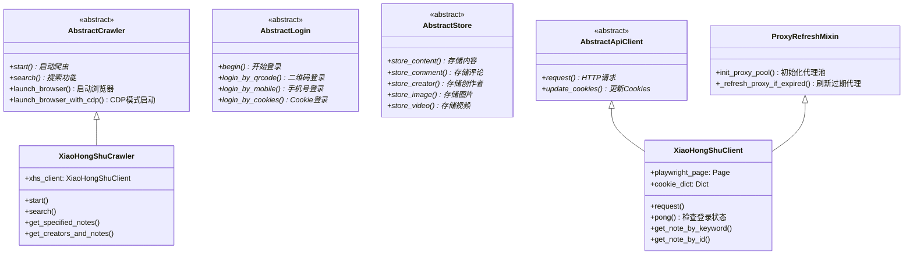

### 4.2 爬虫生命周期

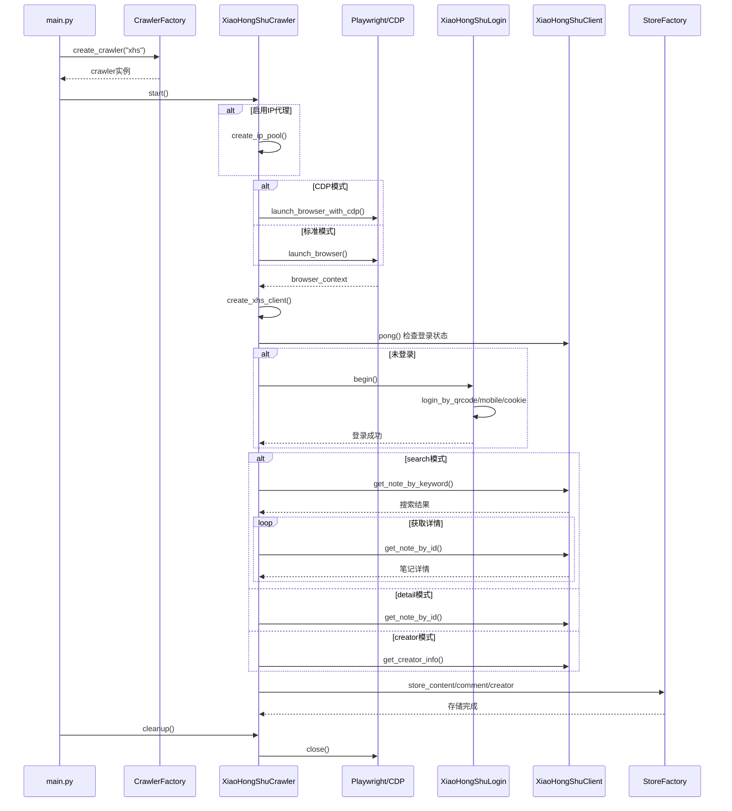

### 4.3 平台爬虫实现结构

每个平台目录包含以下核心文件：

```
media_platform/{platform}/
├── __init__.py         # 模块导出
├── core.py             # 爬虫主实现类
├── client.py           # API客户端
├── login.py            # 登录实现
├── field.py            # 字段/枚举定义
├── exception.py        # 异常定义
├── help.py             # 辅助函数
└── {特殊实现}.py       # 平台特定逻辑
```

### 4.4 三种爬虫模式

| 模式 | 配置值 | 功能描述 | 适用场景 |
|------|--------|---------|---------|
| 搜索模式 | `search` | 根据关键词搜索内容 | 批量获取特定主题内容 |
| 详情模式 | `detail` | 获取指定ID的详情 | 精确获取已知内容 |
| 创作者模式 | `creator` | 获取创作者所有内容 | 追踪特定博主/UP主 |

---

## 5. 数据存储层

### 5.1 存储架构图

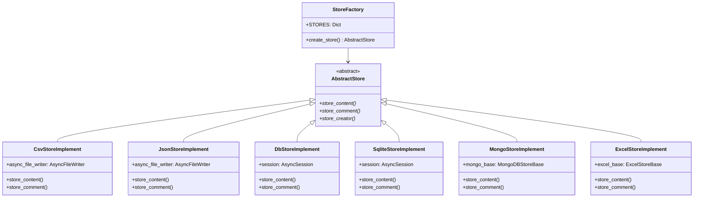

### 5.2 存储工厂模式

```python
# 以抖音为例
class DouyinStoreFactory:
    STORES = {
        "csv": DouyinCsvStoreImplement,
        "db": DouyinDbStoreImplement,
        "json": DouyinJsonStoreImplement,
        "sqlite": DouyinSqliteStoreImplement,
        "mongodb": DouyinMongoStoreImplement,
        "excel": DouyinExcelStoreImplement,
    }

    @staticmethod
    def create_store() -> AbstractStore:
        store_class = DouyinStoreFactory.STORES.get(config.SAVE_DATA_OPTION)
        return store_class()
```

### 5.3 存储方式对比

| 存储方式 | 配置值 | 优点 | 适用场景 |
|---------|--------|-----|---------|
| CSV | `csv` | 简单、通用 | 小规模数据、快速查看 |
| JSON | `json` | 结构完整、易解析 | API对接、数据交换 |
| SQLite | `sqlite` | 轻量、无需服务 | 本地开发、小型项目 |
| MySQL | `db` | 性能好、支持并发 | 生产环境、大规模数据 |
| MongoDB | `mongodb` | 灵活、易扩展 | 非结构化数据、快速迭代 |
| Excel | `excel` | 可视化、易分享 | 报告、数据分析 |

---

## 6. 基础设施层

### 6.1 代理系统架构

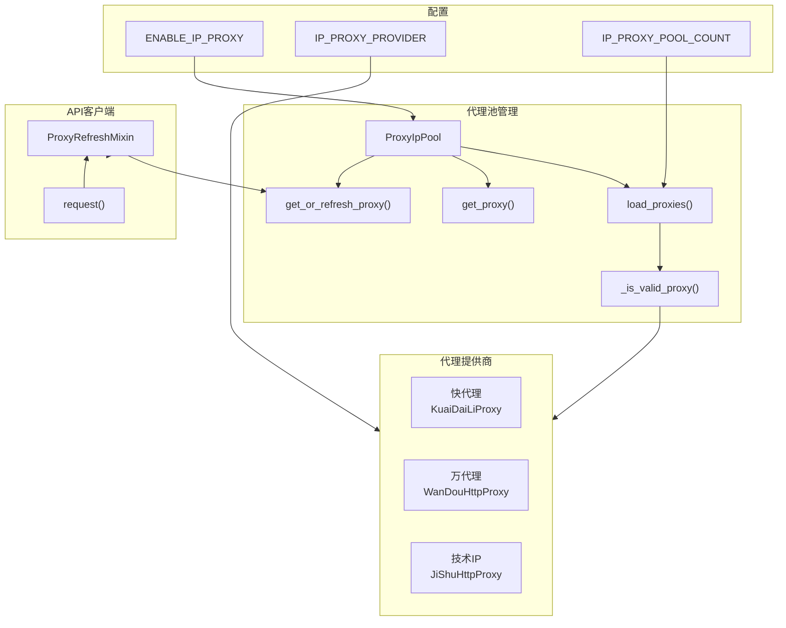

### 6.2 登录流程

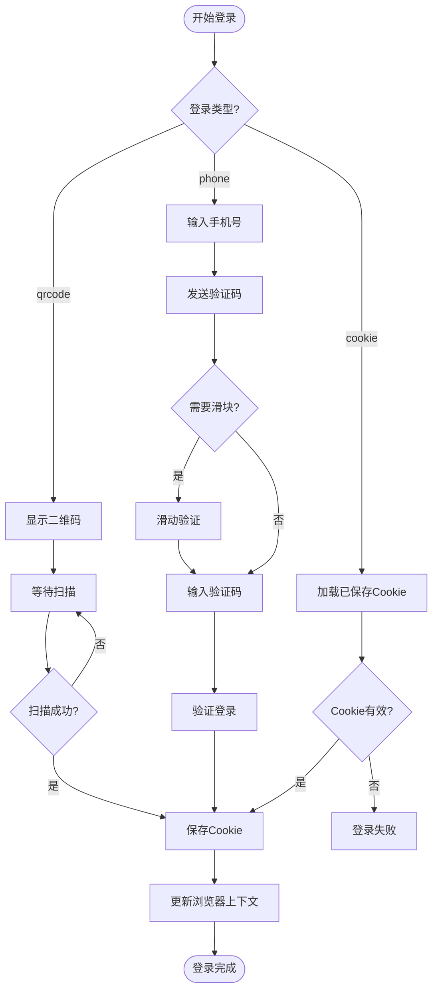

### 6.3 浏览器管理

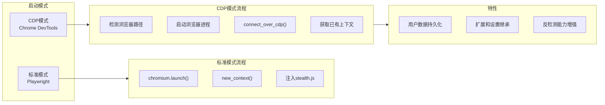

### 6.4 缓存系统

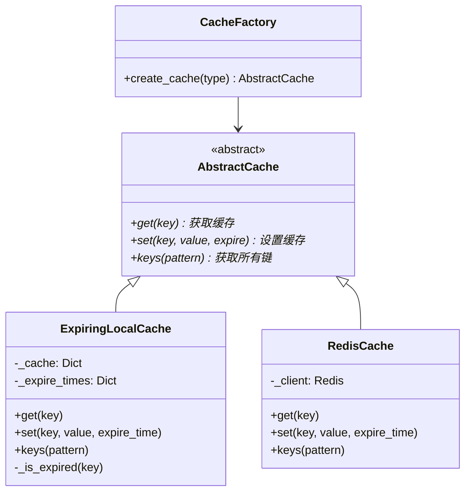

---

## 7. 数据模型

### 7.1 ORM模型关系

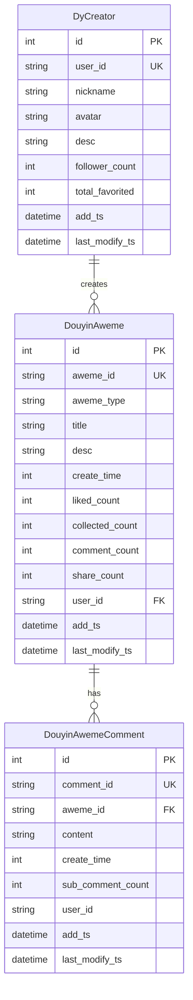

### 7.2 各平台数据表

| 平台 | 内容表 | 评论表 | 创作者表 |
|------|--------|--------|---------|
| 抖音 | DouyinAweme | DouyinAwemeComment | DyCreator |
| 小红书 | XHSNote | XHSNoteComment | XHSCreator |
| 快手 | KuaishouVideo | KuaishouVideoComment | KsCreator |
| B站 | BilibiliVideo | BilibiliVideoComment | BilibiliUpInfo |
| 微博 | WeiboNote | WeiboNoteComment | WeiboCreator |
| 贴吧 | TiebaNote | TiebaNoteComment | - |
| 知乎 | ZhihuContent | ZhihuContentComment | ZhihuCreator |

---

## 8. 配置系统

### 8.1 核心配置项

```python
# config/base_config.py

# 平台选择
PLATFORM = "xhs"  # xhs, dy, ks, bili, wb, tieba, zhihu

# 登录配置
LOGIN_TYPE = "qrcode"  # qrcode, phone, cookie
SAVE_LOGIN_STATE = True

# 爬虫配置
CRAWLER_TYPE = "search"  # search, detail, creator
KEYWORDS = "编程副业,编程兼职"
CRAWLER_MAX_NOTES_COUNT = 15
MAX_CONCURRENCY_NUM = 1

# 评论配置
ENABLE_GET_COMMENTS = True
ENABLE_GET_SUB_COMMENTS = False
CRAWLER_MAX_COMMENTS_COUNT_SINGLENOTES = 10

# 浏览器配置
HEADLESS = False
ENABLE_CDP_MODE = True
CDP_DEBUG_PORT = 9222

# 代理配置
ENABLE_IP_PROXY = False
IP_PROXY_PROVIDER = "kuaidaili"
IP_PROXY_POOL_COUNT = 2

# 存储配置
SAVE_DATA_OPTION = "json"  # csv, db, json, sqlite, mongodb, excel
```

### 8.2 数据库配置

```python
# config/db_config.py

# MySQL
MYSQL_DB_HOST = "localhost"
MYSQL_DB_PORT = 3306
MYSQL_DB_NAME = "media_crawler"

# Redis
REDIS_DB_HOST = "127.0.0.1"
REDIS_DB_PORT = 6379

# MongoDB
MONGODB_HOST = "localhost"
MONGODB_PORT = 27017

# SQLite
SQLITE_DB_PATH = "database/sqlite_tables.db"
```

---

## 9. 工具模块

### 9.1 工具函数概览

| 模块 | 文件 | 主要功能 |
|------|------|---------|
| 应用运行器 | `app_runner.py` | 信号处理、优雅退出、清理管理 |
| 浏览器启动 | `browser_launcher.py` | 检测浏览器路径、启动浏览器进程 |
| CDP管理 | `cdp_browser.py` | CDP连接、浏览器上下文管理 |
| 爬虫工具 | `crawler_util.py` | 二维码识别、验证码处理、User-Agent |
| 文件写入 | `async_file_writer.py` | 异步CSV/JSON写入、词云生成 |
| 滑块验证 | `slider_util.py` | 滑动验证码破解 |
| 时间工具 | `time_util.py` | 时间戳转换、日期处理 |

### 9.2 应用运行管理

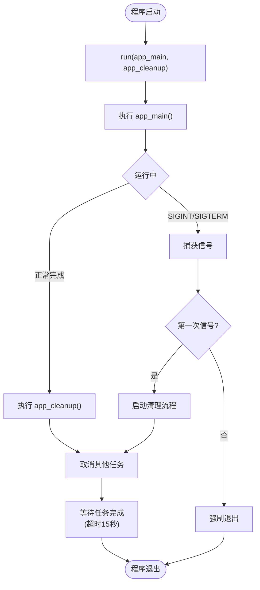

---

## 10. 模块依赖关系

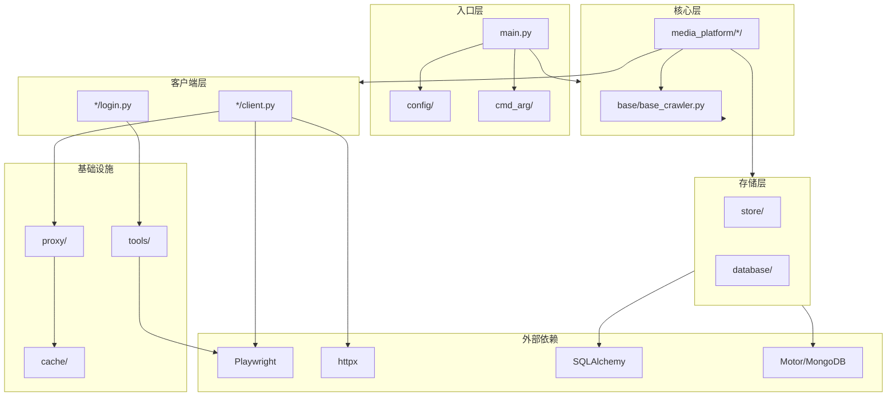

---

## 11. 扩展指南

### 11.1 添加新平台

1. 在 `media_platform/` 下创建新目录
2. 实现以下核心文件：
   - `core.py` - 继承 `AbstractCrawler`
   - `client.py` - 继承 `AbstractApiClient` 和 `ProxyRefreshMixin`
   - `login.py` - 继承 `AbstractLogin`
   - `field.py` - 定义平台枚举
3. 在 `store/` 下创建对应存储目录
4. 在 `main.py` 的 `CrawlerFactory.CRAWLERS` 中注册

### 11.2 添加新存储方式

1. 在 `store/` 下创建新的存储实现类
2. 继承 `AbstractStore` 基类
3. 实现 `store_content`、`store_comment`、`store_creator` 方法
4. 在各平台的 `StoreFactory.STORES` 中注册

### 11.3 添加新代理提供商

1. 在 `proxy/providers/` 下创建新的代理类
2. 继承 `BaseProxy` 基类
3. 实现 `get_proxy()` 方法
4. 在配置中注册

---

## 12. 快速参考

### 12.1 常用命令

```bash
# 启动爬虫
python main.py

# 指定平台
python main.py --platform xhs

# 指定登录方式
python main.py --lt qrcode

# 指定爬虫类型
python main.py --type search
```

### 12.2 关键文件路径

| 用途 | 文件路径 |
|------|---------|
| 程序入口 | `main.py` |
| 核心配置 | `config/base_config.py` |
| 数据库配置 | `config/db_config.py` |
| 爬虫基类 | `base/base_crawler.py` |
| ORM模型 | `database/models.py` |
| 代理池 | `proxy/proxy_ip_pool.py` |
| CDP浏览器 | `tools/cdp_browser.py` |

---

*文档生成时间: 2025-12-18*
